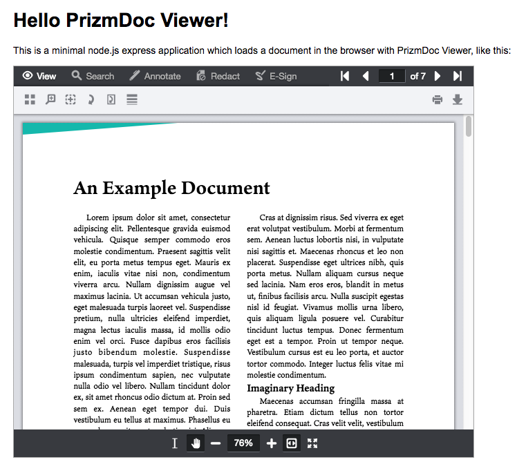
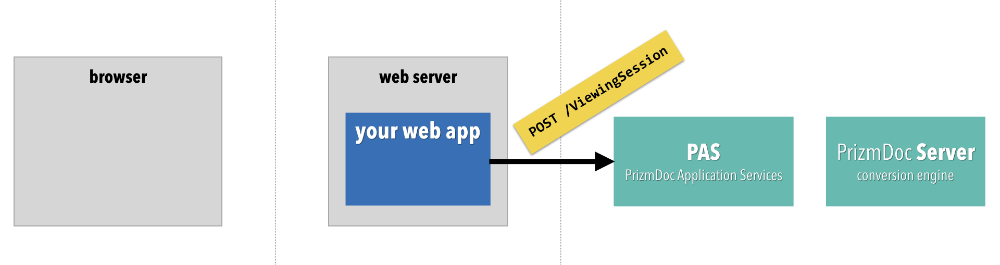
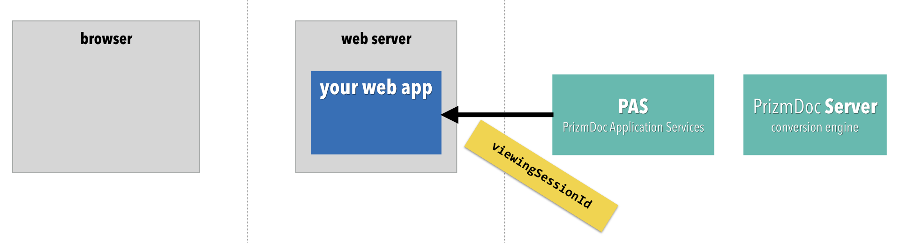
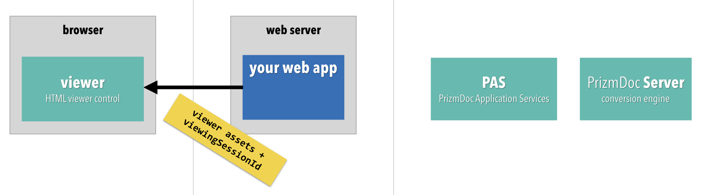
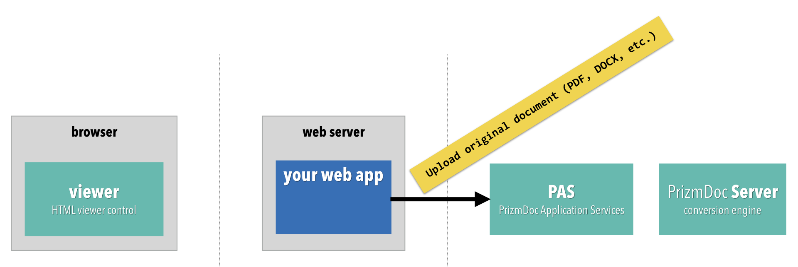
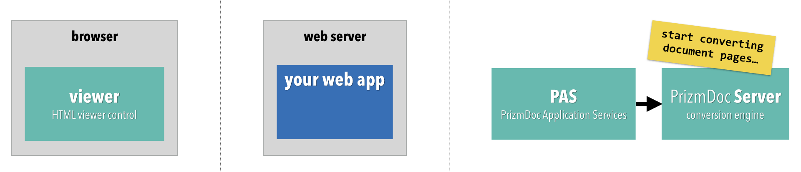
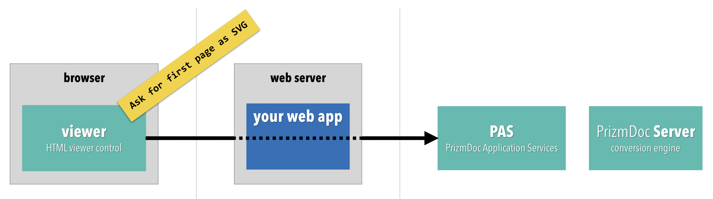
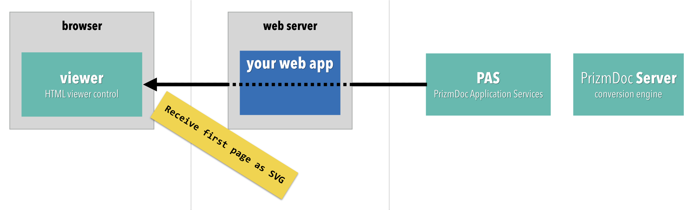
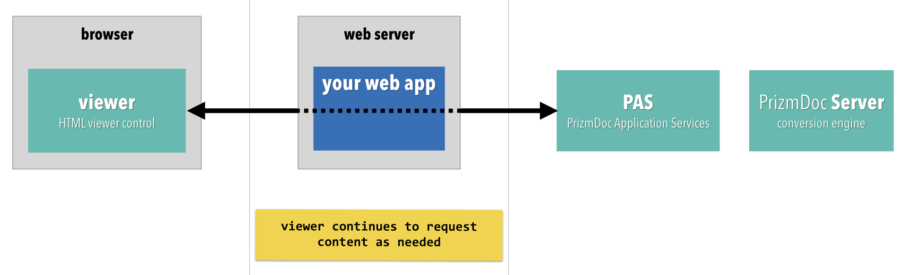

# Hello PrizmDoc Viewer with node.js and HTML

A minimal node.js express app which has integrated PrizmDoc Viewer.

## Setup

### Requirements

- [Node.js](https://nodejs.org) 8 or higher

### Install dependencies

```
npm install
```

### Configure Connection to PAS

Configure how to connect to PAS (PrizmDoc Application Services) by either editing the `config.json5` file.

If you're just getting started, the easiest thing to do is to use [PrizmDoc Cloud](https://cloud.accusoft.com). We host PAS for you and all you need is your [PrizmDoc Cloud](https://cloud.accusoft.com) API key. If you don't have an API key, you can get one for free at https://cloud.accusoft.com.

For PrizmDoc Cloud:

```json
{
  "pasBaseUrl": "https://api.accusoft.com/prizmdoc",
  "apiKey": "YOUR_API_KEY"
}
```

For self-hosted PAS:

```json
{
  "pasBaseUrl": "YOUR_PAS_BASE_URL",
  "pasSecretKey": "YOUR_PAS_SECRET_KEY",
}
```

Alternately, you can set or override any of these values via environment variables:

- `API_KEY`
- `PAS_BASE_URL`
- `PAS_SECRET_KEY`

## Running the Sample

To start the app:

```
npm start
```

This will launch a small web application on `http://localhost:8888`.

You should see output like this:

```
> node index.js

[HPM] Proxy created: /pas-proxy  ->  https://api.accusoft.com/prizmdoc
[HPM] Proxy rewrite rule created: "^/pas-proxy" ~> ""
[HPM] Subscribed to http-proxy events:  [ 'error', 'close' ]
Application running at http://localhost:8888
```

When you visit `http://localhost:8888`, you should see a viewer with an example document, like this:



## Illustrating the Viewing Sequence

When your web application needs to render an HTML page containing a viewer, in order to render the viewer and the first page of document content as fast as possible, there is a sort of "dance" that occurs between the browser and PrizmDoc, with your web application sitting in the middle between the two. Here is how it typically goes:

First, your web application POSTs to PAS to create a new viewing session:



Your web application receives a new `viewingSessionId`:



Your web application then renders the page HTML, instatiating the viewer with the `viewingSessionId` so that, once parsed by the browser, it can begin asking for document content for that viewing session:



Around the same time that the HTML is being sent to the browser, your web application should upload the original source document to PAS so that document content can start being converted for display in the browser:



As soon as the source document is received, PAS hands it off to the powerful PrizmDoc Server backend where the document pages are converted, one by one, to SVG. As soon as a page is converted, it can be delivered back to the browser (even if the remaining pages are still being converted):



Meanwhile, as soon as it has been loaded in the browser, the viewer begins repeatedly asking for the first page of document content ("Are you there yet? Are you there yet?"):



As soon as the first page of SVG content is available, PAS returns it, allowing the viewer to display it to the end user:



Of course, all of this happens _very_ quickly, allowing your users to start viewing and interacting with the document as fast as possible. As they interact with the document, the viewer continues to make requests to PAS for document content as needed:



There are a couple of key things to note about this sequence:

1. **You should render your HTML as soon as possible.** As soon as you have a `viewingSessionId`, you should send your HTML to the browser so that the viewer can start loading.
2. **Your web application or web server needs to have a route that the viewer can use as a proxy to PAS.** The viewer is going to make lots of requests to PAS in order to load document content. These requests need to be proxied through either your web application or web server at a route of your choosing. This sample illustrates how to set this up with a simple proxy that runs as part of this web application (see `app.js` and `pas/createProxyRouteToPAS.js`).
